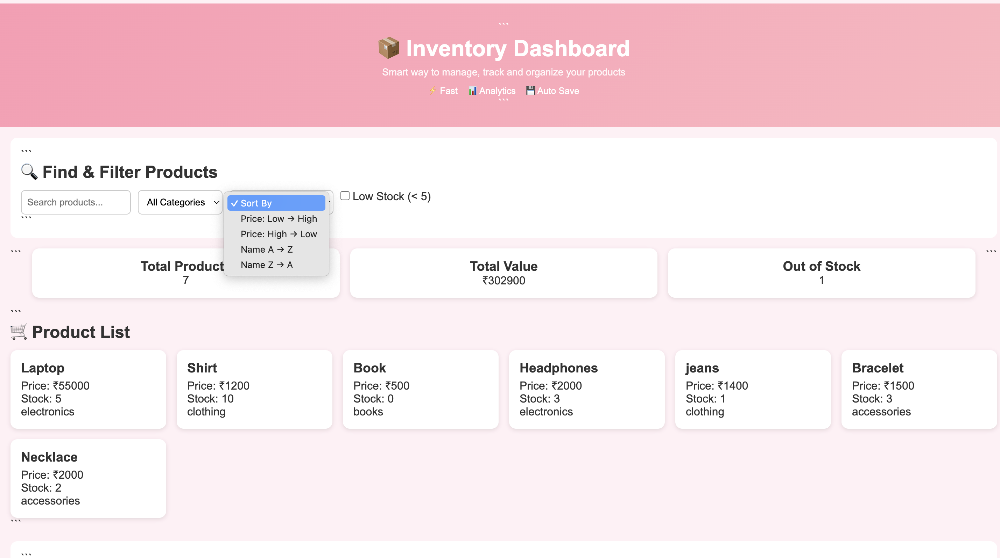
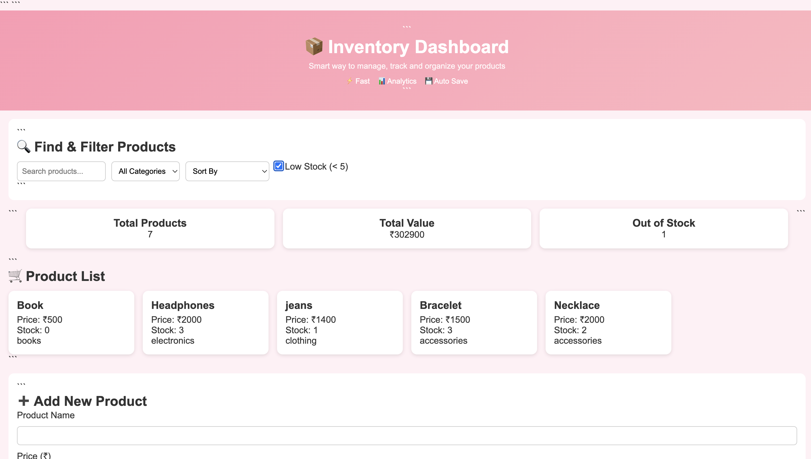
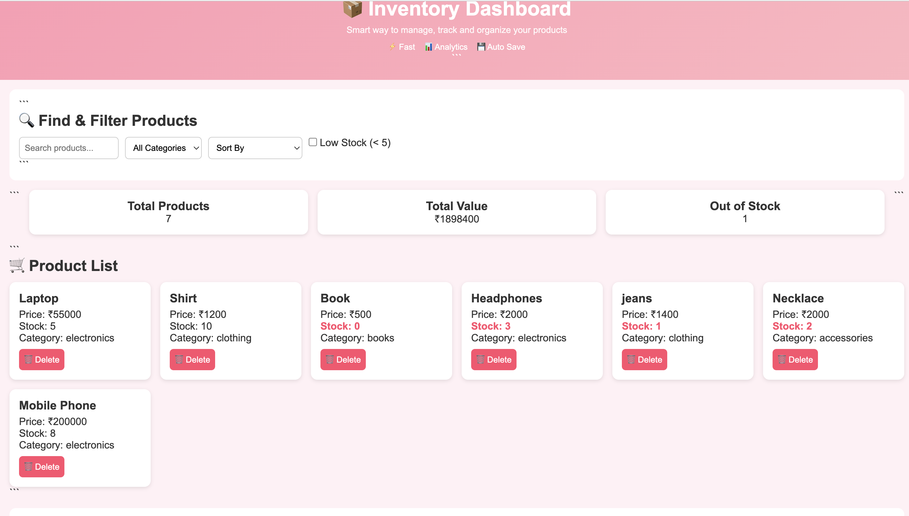
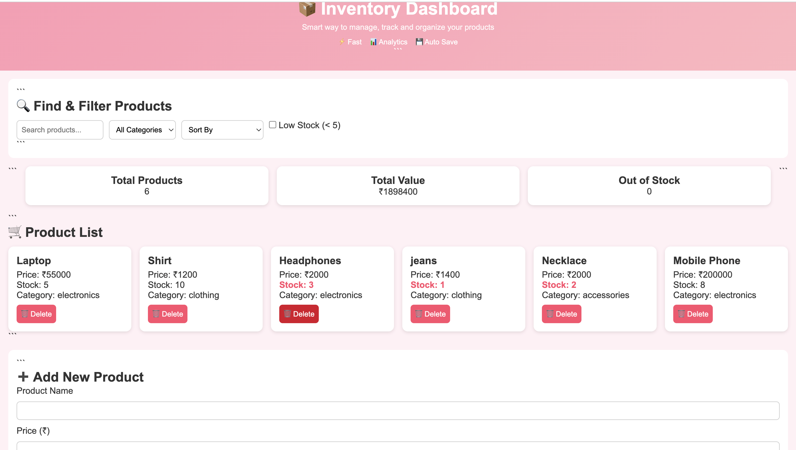

# 📦 Product Inventory Dashboard

A dynamic and interactive **Product Inventory Dashboard** built using **HTML, CSS, JavaScript**.
This application allows users to manage products efficiently with features like search, filtering, sorting, analytics, and persistent storage.

---

## 🚀 Project Overview

This project simulates a real-world inventory management system where users can:

* View products dynamically
* Search, filter, and sort products
* Add, edit, and delete products
* Track inventory analytics
* Persist data using localStorage

---

## 🛠️ Tech Stack

* HTML5
* CSS3
* JavaScript 
* Browser localStorage

---

# 🎯 Features (Mapped to Evaluation Rubric)

## ✅ Dynamic Product Rendering

* All products are rendered dynamically using JavaScript
* No hardcoded HTML product cards are used
* Products are generated from a data array

---

## 🔍 Search Feature

* Real-time search functionality
* Filters products by name while typing
* Case-insensitive matching

---

## 🎯 Filtering Implementation

* Filter products by category
* Low stock filter (stock < 5)
* Filters work together seamlessly

---

## 🔄 Sorting Functionality

* Price: Low → High
* Price: High → Low
* Alphabetical A → Z
* Alphabetical Z → A

---

## 📊 Inventory Analytics

Displays real-time analytics:

* Total Products
* Total Inventory Value (price × stock)
* Out of Stock Count

---

## ➕ Add Product Feature

* Users can add new products via form
* Product appears instantly in UI
* Analytics update automatically

---

## ❌ Delete Product Feature

* Each product card has a delete button
* Removes product from UI immediately
* Updates localStorage and analytics

---

## 💾 LocalStorage Persistence

* Product data is stored in browser localStorage
* Data remains even after page refresh

---

## ⏳ Simulated API Loading

* Implemented using Promise + setTimeout
* Displays "Loading products..." before rendering

---

## 🧱 UI Layout & Structure

The application follows a clear layout:

* Header (Dashboard Title)
* Controls Section (Search, Filter, Sort)
* Analytics Section
* Product Grid
* Add Product Form

---

## 🧠 Code Quality & Readability

* Clean and modular JavaScript
* Meaningful variable names
* Proper comments explaining logic
* Organized structure

---

# ⭐ Bonus Features

## ✏️ Edit Product Feature

* Users can edit product details
* Updates reflect instantly in UI and storage

---

## 🔗 Multiple Filters Working Together

* Search + Category + Sorting + Stock filter all work together correctly

---

## 🎨 UI Enhancements

* Soft pink theme for better aesthetics
* Hover effects on product cards
* Highlight for low stock items

---
## 📸 Screenshots

### 🏠 Dashboard View
Displays all products along with analytics.

---

### 🔍 Category Filtering
Filters products based on selected category.

---

### 🔄 Sorting Feature
Products sorted by price and name.

---

### ⚠️ Low Stock Filter
Shows products with stock less than 5.

---

### ➕ Add Product
Form used to add a new product.

---

### ✅ Product Added
New product appears instantly in list.

---

### 🗑️ Delete Product
Product removed from dashboard.

---

### ✔️ After Deletion
Updated product list after deletion.

# ▶️ How to Run the Project

1. Download or clone the repository
2. Navigate to:
   mini_app/product_inventory_dashboard/
3. Open:
   index.html
4. Run in browser

---

# ⚠️ Important Notes

* No external libraries or frameworks used
* Fully built using Vanilla JavaScript
* Works in Chrome, Edge, and Firefox

---

# 💡 Future Improvements

* Add product images
* Replace prompt edit with modal UI
* Add pagination
* Add toast notifications

---

# 👩‍💻 Author

Developed as part of a frontend mini app assignment.

---

